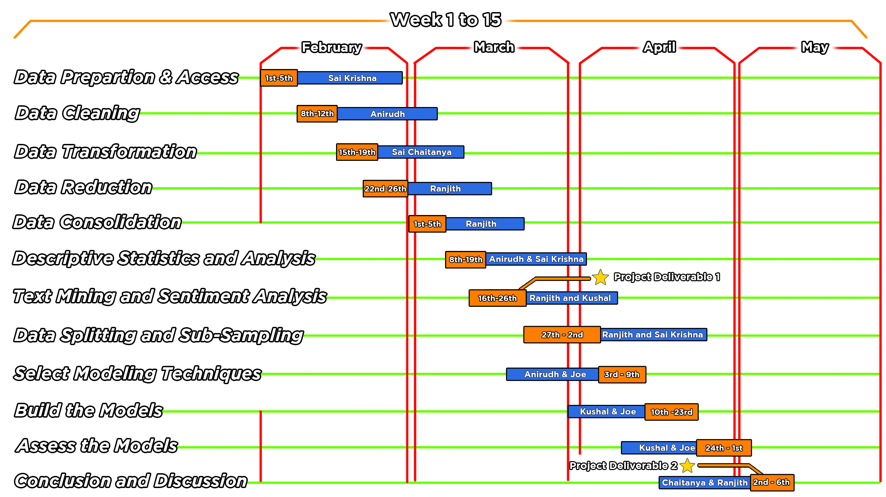

## Executive Summary: 

The proposed project aims to address the problem of efficiently categorizing large volumes of computer science research papers using natural language processing (NLP) and machine learning (ML) techniques.The increasing volume of research papers in the field of computer science makes it challenging for researchers and industry practitioners to keep up with the latest advancements and discoveries.We got the data from arxiv "https://arxiv.org/abs/2206.04615", did scrapped the data from Kaggle website https://www.kaggle.com/datasets/Cornell-University/arxiv and then converted it into a CSV file to perform operations on it. Automated categorization can help to streamline this process and make it easier to find and access relevant information.The project involved the use of a dataset containing over 1.7 million research papers from the arXiv repository. The dataset was pre-processed, cleaned, and transformed to prepare it for analysis. Data reduction techniques were used to select only the most relevant data for modeling. Exploratory data analysis (EDA) was conducted to gain insights into the research papers' characteristics and trends in the field of computer science. 

The findings revealed important patterns, such as the dominance of machine learning research, the growth of research papers contributed each year, and the most common words used in abstracts and titles.Based on the EDA findings, we will build 5 models using NLP techniques using Feature Selection techniques such as TF-IDF vs Word2Vec vs Bag of words to automatically categorize research papers into different classes. The various classes were clubbed whenever the relative frequency was less than 3 % for any particular class. Additionally, a couple of Transfer-learning models were built : Vader and BERT to extract emotions out of the data, as there are no sentiment classes already associated with our existing data. 

The model's performance was evaluated using several metrics, and the results showed that it was highly accurate in predicting the categories of research papers. The project's outcomes and recommendations include the development of an automated categorization model that can help researchers and industry practitioners save time and effort in categorizing research papers. The model can also help in identifying research gaps and trends in the field, leading to new discoveries and innovations. The project's benefits extend to researchers, industry practitioners, policymakers, and other stakeholders in the field of computer science. They can benefit from the model's accurate and efficient categorization of research papers, leading to faster access to relevant information and more informed decision-making. The potential problem or opportunity is the increasing volume of research papers in the field of computer science, which makes it challenging to keep up with the latest advancements and discoveries. The proposed solution addresses this problem by providing an automated categorization model that can help streamline the process and make it easier to find and access relevant information. This project is important as it addresses a critical need in the field of computer science and can have significant implications for research, innovation, and technological advancements. As the field continues to grow and evolve, automated categorization models can help keep pace with the increasing volume of research papers and ensure that researchers and industry practitioners have access to the latest information and discoveries.

## Statement of Scope
### Project objectives:
* To pre-process the dataset of research papers by employing NLP techniques such as tokenization, stemming, and stop-word removal, to prepare the text data for modeling.
* To develop a classification model using ML algorithms that can accurately categorize research papers into one of the predefined categories listed in the arXiv taxonomy for computer science.
* To evaluate the efficiency and accuracy of the developed system using various performance metrics, such as precision, recall, and F1 score.

### Variables: 
The project will use the following variables:
* Independent Variable: The research papers dataset from the arXiv repository, consisting of over 1.7 million research papers from various academic disciplines.
* Dependent Variable: The automated system for categorizing research papers developed using NLP and ML techniques.
* Control Variables: The categories of research papers from the arXiv taxonomy for computer science and the performance metrics used for evaluating the developed system.
* Unit of Analysis: The individual research papers from the dataset will be categorized using the developed system.
 

The following categories have been identified in Computer science department from [arxiv taxonomy](https://arxiv.org/category_taxonomy)
| Abbreviation | Meaning |
|:---|:---|
| cs.AI  | Artificial Intelligence
| cs.AR  | Hardware Architecture
| cs.CC  | Computational Complexity
| cs.CE  | Computational Engineering, Finance, and Science
| cs.CG  | Computational Geometry
| cs.CL  | Computation and Language
| cs.CR  | Cryptography and Security
| cs.CV  | Computer Vision and Pattern Recognition
| cs.CY  | Computers and Society
| cs.DB  | Databases
| cs.DC  | Distributed, Parallel, and Cluster Computing
| cs.DL  | Digital Libraries
| cs.DM  | Discrete Mathematics
| cs.DS  | Data Structures and Algorithms
| cs.ET  | Emerging Technologies
| cs.FL  | Formal Languages and Automata Theory
| cs.GL  | General Literature
| cs.GR  | Graphics
| cs.GT  | Computer Science and Game Theory
| cs.HC  | Human-Computer Interaction
| cs.IR  | Information Retrieval
| cs.IT  | Information Theory
| cs.LG  | Machine Learning
| cs.LO  | Logic in Computer Science
| cs.MA  | Multiagent Systems
| cs.MM  | Multimedia
| cs.MS  | Mathematical Software
| cs.NA  | Numerical Analysis
| cs.NE  | Neural and Evolutionary Computing
| cs.NI  | Networking and Internet Architecture
| cs.OH  | Other Computer Science
| cs.OS  | Operating Systems
| cs.PF  | Performance
| cs.PL  | Programming Languages
| cs.RO  | Robotics
| cs.SC  | Symbolic Computation
| cs.SD  | Sound
| cs.SE  | Software Engineering
| cs.SI  | Social and Information Networks
| cs.SY  | Systems and Control

## Project Schedule





## Data Preparation
The data preparation happened in 2 different steps, which were carried out in [prepare_dataframe.py](code/prepare_dataframe.py) and [clean_data.py](code/clean_data.py) :
* [prepare_dataframe.py](code/prepare_dataframe.py) : Python script to read a JSON, remove irrelevant columns and convert into a dataframe
* [clean_data.py](code/clean_data.py) : Python script to extract categories, clean the text, remove duplicates etc.
* [arxiv-metadata-oai-snapshot_sample.json](data/arxiv-metadata-oai-snapshot_sample.json) : Sample of original JSON data. Could not upload the original file due to size limitations on GitHub
* [computer_science_papers_sample.csv](data/computer_science_papers_sample.csv) : Tab delimited csv containing computer science papers.
* [text_data_for_modelling_sample.csv](data/text_data_for_modelling_sample.csv) : Tab delimited csv containing information about abstract, paper titles and categories. This will act as our training data.
* [cleaned_data_for_eda_sample.csv](data/cleaned_data_for_eda_sample.csv) : Tab delimited csv containing papers along with additional information like number of categories, authors etc. This helped up in carrying out EDA which is discussed in upcoming section.

### Data Access

The data was sourced from the ‘arxiv’ Database containing information of over hundreds of thousands of research papers in various fields. Data was available on Kaggle. The sourced arxiv papers were in the form of a large JSON, which was difficult to process. Hence, we used the ‘DASK’ open-source computing framework for extracting the data. DASK offers a high-scale parallel computing environment for handling and processing large data.  

Below is a sample record from our JSON data:

```JSON
{"id":"0704.0001",
"submitter":"Pavel Nadolsky","authors":"C. Bal\\'azs, E. L. Berger, P. M. Nadolsky, C.-P. Yuan",
"title":"Calculation of prompt diphoton production cross sections at Tevatron and\n  LHC energies",
"comments":"37 pages, 15 figures; published version","journal-ref":"Phys.Rev.D76:013009,2007",
"doi":"10.1103/PhysRevD.76.013009","report-no":"ANL-HEP-PR-07-12",
"categories":"hep-ph","license":null,
"abstract":"  A fully differential calculation in perturbative quantum chromodynamics is\npresented for the production of massive photon pairs at hadron colliders. All\nnext-to-leading order perturbative contributions from quark-antiquark,\ngluon-(anti)quark, and gluon-gluon subprocesses are included, as well as\nall-orders resummation of initial-state gluon radiation valid at\nnext-to-next-to-leading logarithmic accuracy. The region of phase space is\nspecified in which the calculation is most reliable. Good agreement is\ndemonstrated with data from the Fermilab Tevatron, and predictions are made for\nmore detailed tests with CDF and DO data. Predictions are shown for\ndistributions of diphoton pairs produced at the energy of the Large Hadron\nCollider (LHC). Distributions of the diphoton pairs from the decay of a Higgs\nboson are contrasted with those produced from QCD processes at the LHC, showing\nthat enhanced sensitivity to the signal can be obtained with judicious\nselection of events.\n",
"versions":[{"version":"v1","created":"Mon, 2 Apr 2007 19:18:42 GMT"},
{"version":"v2","created":"Tue, 24 Jul 2007 20:10:27 GMT"}],
"update_date":"2008-11-26",
"authors_parsed":[["Bal\u00e1zs","C.",""],["Berger","E. L.",""],["Nadolsky","P. M.",""],["Yuan","C. -P.",""]]}
```
First, we divide the data into chunks of 256 MB and process each chunk in one pass. The following code was used:

```Python
records = dd.read_json('data/arxiv-metadata-oai-snapshot.json',  blocksize='256MB') # Reading the JSON in chunks of 256 MB
 
for i in range(records.npartitions):
    print('Processing '+ str(i)+'th partition')
    try:
        partition_data = records.get_partition(i).compute()
    ...
```

For each chunk, we start with filtering out the papers which had 'cs' as one of their categories. This was done by using the regex:

```Python
pattern='[\s\b]cs\.[A-z.]'
```
The second step was to only pull the required columns. Columns like 'comments', 'versions', 'journal-ref' etc were dropped. There were 2 columns that had author info, one of them being parsed and another one being the string. We chose the parsed column called 'authors_parsed', which made it easy for us to distinguish between authors.
The data from all the chunks was collected into a tab delimited CSV. Also, some chunks had to be processed separately due to 'id' column, whose format was changed by arxiv in later years. 
The last step was to format the authors from format like ["Berger","E. L.",""] to *E L Berger*. This was done by concatenating components of the list in the right order


### Data Cleaning
Data cleaning is an essential step in text analytics as it helps to improve the quality and accuracy of the data used for analysis. Text data often contains noise, errors, and inconsistencies that can affect the performance of the analysis. The following are some common data cleaning techniques used in text analytics:
Removing stop words: Stop words are common words like "the," "and," and "is" which don’t add lot of value to our analysis. So we remove it from our text to improve the performance of our analysis.
Below is the summary of the data cleaning steps we undertook.


#### Removing duplicated titles: 
The dataset contains duplicated titles which add redundancy to our data and will not help with the performance of our analysis. So, we removed the duplicated titles.
*Code Snippet:*
```Python
duplicated_rows = dataframe[dataframe[column].duplicated()]
dataframe.drop_duplicates(subset=[column], inplace=True)
```


#### Removing Non-CS categories:
For our analysis, we are considering only papers published under the Computer Science field. So, we removed all the categories which are not in CS category.
*Code Snippet:*
```Python
pattern = r'\bcs\.\w+' 
dataframe[column] = dataframe[column].apply(lambda x: re.findall(pattern, x))
```


#### Removing the accents:
There are many scientific words which are in different languages than English, for example accent words (like 𝑘). So, we converted them to English word (like k)
*Code Snippet:*
```Python
dataframe[column] = dataframe[column].apply(lambda x: unidecode.unidecode(x))
```


#### Removing punctuations: 
Punctuation marks, such as commas and periods, are removed to eliminate noise and improve the consistency of the data.
*Code Snippet:*
```Python
dataframe[column] = dataframe[column].str.replace(patternpunc,' ')
```


#### Removing single alphabet words:
We have removed the words which are single alphabets in the data because they are irrelevant and can lead to lower accuracy in our analysis.
*Code Snippet:*
```Python
dataframe[column] = dataframe[column].apply(lambda x: re.sub(pattern='\b[A-z]\b', repl="", string=x))
```


### Data Transformation
Data transformation is the process of converting raw text data into a format that is suitable for analysis. The following are the data transformation techniques used in this analytics project:


#### Removing redundant columns: 
We have removed the redundant columns from our dataset and only kept the columns which are required for our analysis.


#### Changing Data Type: 
Based on the data, we have made required changes in datatype of the variables.
*Code Snippet:*
```Python
def change_datatpyes(dataframe, int_columns=None,  date_columns=None):
    
    if int_columns:
        for column in int_columns:
            dataframe[column] = pd.to_numeric(dataframe[column])
                
    if date_columns:
        for column in date_columns:
            dataframe[column] = pd.to_datetime(dataframe[column])
    
    return data
```


#### Converted text to lowercase: 
We have transformed all the text into lowercase in our dataset. Changing the text to lowercase will improve the analysis as all the text is in same case.
*Code Snippet:*
```Python
    dataframe[column] = dataframe[column].str.lower()
```


### Data Reduction
Data reduction happened in multiple stages. The first time it happened was while importing the data, where we did not consider the columns that would be used for our analysis.
In the second part, we removed stopwords, punctuations and single-alphabet words (like 'x', 'y'), These have been described in their respective sections.
Lastly, from this dataset, we prepare 2 data: one for which we keep these columns for EDA. The other data would be used for modelling in future. These are the data reduction steps we undertook for modelling data:
1. As we now know that a paper can have up to 7 target categories, we do not need those many for modelling. We choose up to 3 categories for each paper. If it has less than 3 categories, then less than 3 would be considered. Anything above 3 categories would be trimmed to first 3.
The following piece of code extracts individual categories out of the list of categories. If 2nd and 3rd are not available, it fills an empty string in the value
  ```Python
  data['primary_category'] = data['categories'].apply(lambda x:x[0]) 
  data['secondary_category'] = [i[1] if len(i)>1 else '' for i in data['categories']]
  data['tertiary_category'] = [i[2] if len(i)>2 else '' for i in data['categories']]    
  ```
2. Only the columns 'abstract' and 'title' were considered for modelling as they contain all the text information. Other columns like *submitter*, *authors* etc were not considered. This dataset is stored as [modelling data](data/text_data_for_modelling_sample.csv). Again, due to size limits on GitHub, we were not able to push the entire dataset.


### Data Consolidation
For our use case, data was already in the form of a single JSON file. However, due to limitations on RAM size, the data had to be first divided into chunks and then consolidated after removing the non-relevant data (papers that were not related to CS)
This was utilized using both dask and pandas. 
Firstly, the data was read in chunks of 256 MB, as stated in Data Access section. Then, each chunk was filtered for only the data in which 'cs' was in categories. These filtered chunks would be appended to consolidate in a single file.
```Python
records = dd.read_json('data/arxiv-metadata-oai-snapshot.json',  blocksize='256MB') # Reading the JSON in chunks of 256 MB
    
cs_papers_data = pd.DataFrame()  #empty dataframe

for i in range(records.npartitions): # Iterating through all partitions
    print('Processing '+ str(i)+'th partition')
    try:
        partition_data = records.get_partition(i).compute()

        cs_papers_parition_data = filter_cs_papers(partition_data, pattern='[\s\b]cs\.[A-z.]') # Using regex to pull any cs columns

        cs_papers_parition_data.drop(columns=['comments', 'journal-ref', 'doi', 'license', \
                                     'versions', 'authors', 'report-no'], inplace=True, errors='ignore')
        cs_papers_data = cs_papers_data.append(cs_papers_parition_data) # Appending into the dataframe
```
Some of the partitions were processed separately due to the issues with ID column. The format of 'id' column were changed by arxiv, so there were data type issues occurring while calling *compute()* function. Hence the later chunks got processed separately for which data type was defined explicitly.


### Data Dictionary
The dataset contains several variables that provide information about academic works, such as papers or articles.

| Attribute Name | Description | Data Type | Source | Data | Example |
|:---|:---|:---:|:---|:---|:---:|
|ID |	Represents a unique identifier for each record in the dataset |	Integer |	https://www.kaggle.com/datasets/Cornell-University/arxiv | [computer_science_papers_sample.csv](data/computer_science_papers_sample.csv) |	704.0001 |
|Submitter	| Person or entity that submitted the record to the dataset.	| String |	https://www.kaggle.com/datasets/Cornell-University/arxiv	|[computer_science_papers_sample.csv](data/computer_science_papers_sample.csv) | Pavel Nadolsky
| Authors |	The authors of the paper that is described |	String |	 https://www.kaggle.com/datasets/Cornell-University/arxiv | [computer_science_papers_sample.csv](data/computer_science_papers_sample.csv) | 	E. L. Berger, P. M. Nadolsky |
|Title  |	Represents the title of the paper |	String |	https://www.kaggle.com/datasets/Cornell-University/arxiv | [computer_science_papers_sample.csv](data/computer_science_papers_sample.csv) |	Calculation of prompt diphoton production cross sections |
| Categories	| The categories or topics that the paper is related to |	String |	https://www.kaggle.com/datasets/Cornell-University/arxiv | [computer_science_papers_sample.csv](data/computer_science_papers_sample.csv) |	hep-ph |
| Abstract	| Summary of the content of the paper	| String	| https://www.kaggle.com/datasets/Cornell-University/arxiv	| [computer_science_papers_sample.csv](data/computer_science_papers_sample.csv) | A fully differential calculation in perturbative quantum chromodynamics is presented for the production of massive photon pairs at hadron colliders. All next-to-leading order perturbative contributions from quark-antiquark, gluon-(anti)quark, and gluon-gluon subprocesses are included, as well as all-orders resummation of initial-state gluon radiation valid at next-to-next-to-leading logarithmic accuracy.|
| Update_date |	The date when the record was last updated.|	Timestamp |	https://www.kaggle.com/datasets/Cornell-University/arxiv | [computer_science_papers_sample.csv](data/computer_science_papers_sample.csv) |	11/26/2008 |

| Attribute | Name Purpose |
|:---|:---|
| ID | A unique identifier for each record in the dataset that can be used to keep track of each paper's information. |
| Submitter | The person or entity that submitted the record to the dataset. This information can be used to track submissions and their sources. |
| Authors | The names of the authors of each paper can be used to identify the contributors to each research paper and their respective expertise.|
| Title | The title of each paper can provide information on the subject matter being researched and can be used to categorize papers into different fields of study.|
|Categories | The categories or topics that each paper is related to can be used to analyze the frequency of research in different fields of study, and to identify patterns in the growth of specific research areas over time. |
| Abstract | The summary of the content of each paper can provide a brief overview of the research being conducted and can be used to identify keywords that are commonly used in different fields of study. |
| Update_date | The date when each record was last updated can be used to track changes in research over time, and to identify trends in the evolution of different research topics. |

 
## Descriptive Statistics and Analysis


